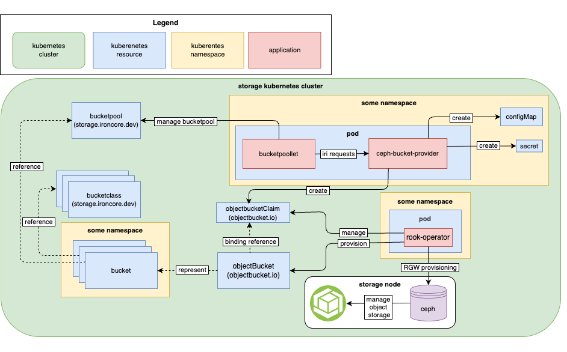

# High-Level Architecture of ceph-bucket-provider

This document provides a high-level overview of the `ceph-bucket-provider`.
It explains the bucket provider's function within the `ironcore` ecosystem and
its interaction with other components using a communication diagram.

|  |
| :---: |
| *High-level architecture design of components related to the ceph-bucket-provider* |

## ceph-bucket-provider

The `ceph-bucket-provider` is a stateless, pluggable component in the `ironcore` ecosystem that implements the [`ironcore Runtime Interface`][bucketRuntime] (IRI). It translates high-level bucket requests into Kubernetes resources, delegating actual bucket provisioning and RGW operations to the Rook Operator and the underlying Ceph cluster. It creates and manages Kubernetes CRDs (like `ObjectBucketClaim (OBC)`). It runs as a dedicated application that:

- Listens for `gRPC` requests from the `bucketpoollet`.
- Manages the lifecycle of an object bucket (create, delete, configure policies).
- Initiates bucket provisioning workflows that the Rook Operator executes by configuring the required Ceph RGW resources.

**Key responsibilities:**

- Provision new object buckets based on `OBC` requests in Ceph RGW.
- Generate and return credentials (Secrets) and connection information (ConfigMaps).
- Interface directly with Ceph RADOS Gateway (RGW) for object storage operations.

## Bucketpoollet

`bucketpoollet` is a controller within the `ironcore` framework that:

- When a claim is detected, it sends `gRPC` requests to `ceph-bucket-provider` for actual bucket provisioning.
- Links object resources to the correct `bucketpool`, ensuring consistent resource allocation and lifecycle management.

It acts as an orchestrator, managing the lifecycle of bucket requests and updating their status in the `ironcore API`.

## BucketClass

A `bucketclass` defines policies for bucket creation:

- Specifies the target `bucketpool` or storage backend (such as Ceph RGW).
- It is referenced by an `OBC` to determine how and where the bucket should be provisioned.

## ObjectBucketClaim (OBC) and ObjectBucket (OB)

- **OBC:** A user or application request for a new object storage bucket. It is a Kubernetes namespaced resource requested by applications, similar to a `PersistentVolumeClaim`, that triggers the provisioning process and requests a new object bucket.
- **OB:** Represents the actual bucket once provisioned in the storage backend, linked to its corresponding  `OBC`.

**Claim binding flow:**

1. `OBC` references a `bucketclass`.
1. The `ceph-bucket-provider` provisions a new bucket and creates the corresponding `OB`.
1. Access credentials (`Secret`) and endpoint info (`ConfigMap`) are injected into the `OBC’s` namespace for application use.

## Secret and ConfigMap

Once a bucket is provisioned, the `ceph-bucket-provider` creates a `Secret` containing the access/secret keys and `ConfigMap` containing the bucket endpoint information.

These resources include the connection endpoint, bucket name, and credentials required for application access.
They can be mounted into application pods, enabling them to connect to the bucket via the S3 API.

## Rook Operator

The Rook Operator acts as a Kubernetes Operator for managing Ceph storage clusters:

- Ensures that the RGW service is healthy and available.
- Routes the request to Ceph for bucket creation.
- Creates the corresponding ObjectBucket resource upon successful provisioning.

## Ceph

[Ceph] is an open-source, distributed storage system that provides scalability and fault tolerance.
Within this architecture:

- Stores and manages object buckets as the primary object storage backend.
- Distributes data and metadata across a cluster of nodes to eliminate any single point of failure.
- Provides the S3/Swift API interface via `RADOS Gateway (RGW)`, which is leveraged by the `ceph-bucket-provider`.

[bucketRuntime]: <https://ironcore.dev/iaas/architecture/runtime-interface.html>
[Ceph]: <https://ceph.io/en/>
