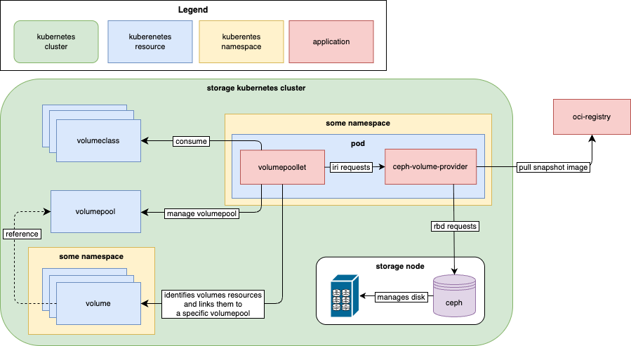

# High-Level Architecture of ceph-volume-provider

This document provides a high-level overview of the `ceph-volume-provider`.
It explains the provider's function within the `ironcore` ecosystem and
its interaction with other components using communication diagram.

|  |
| :---: |
| *High-level architecture design of components related to the ceph-volume-provider* |

## ceph-volume-provider

The **`ceph-volume-provider`** is a stateless, pluggable component in `ironcore` ecosystem that implements the [`ironcore Runtime Interface`][volumeRuntime] (IRI).

Its primary role is to translate high-level volume requests into native Ceph operations. It runs as a dedicated application that:

- Listens for `gRPC` requests from the `volumepoollet`
- Manages the lifecycle of a volume (create, resize, delete).
- Interacts directly with a Ceph cluster using the `librbd` library.

**`Librbd`** is a C++ client library for the [RADOS Block Device protocol][rbd]. It enables the provider to interact programmatically with Ceph [RBD Images][rbdImages] without invoking CLI tools.

Key responsibilities:

- Sends commands to Ceph cluster.
- Handles the low-level communication with Monitors (**MONs**) and Object Storage Daemons (**OSDs**).
- Executes operations like image creation, deletion, resize.

## Volumepoollet

**`volumepoollet`** is a controller in `ironcore` framework that:

- Watches for `volume` resources in assigned volumepool.
- Sends `gRPC` request to `ceph-volume-provider` for actual provisioning.

It acts as an orchestrator, ensuring volume requests are processed and their statuses updated in the `ironcore API`.

## OCI registry

An [**OCI (Open Container Initiative) Registry**][ociRegistry] stores and distributes container images and other OCI-compliant artifacts.
`ceph-volume-provider` can pull these images(often OS-based images) and create bootable volumes by cloning
OS image can be created using the [`ironcore-image`][ironcoreImage] tool.

## Ceph

[Ceph] is an open-source, distributed storage system providing scalability and fault tolerance.
Within this architecture:

- It stores RBD images as primary block storage backend.
- Distributes data and metadata across cluster of nodes to eliminate single point of failure.

[rbd]: <https://docs.ceph.com/en/reef/rbd/>
[ironcoreImage]: <https://github.com/ironcore-dev/ironcore-image>
[ociRegistry]: <https://opencontainers.org/posts/blog/2024-03-13-image-and-distribution-1-1/>
[rbdImages]: <https://docs.ceph.com/en/reef/man/8/rbd/>
[Ceph]: <https://ceph.io/en/>
[volumeRuntime]: <https://ironcore.dev/iaas/architecture/runtime-interface.html>
