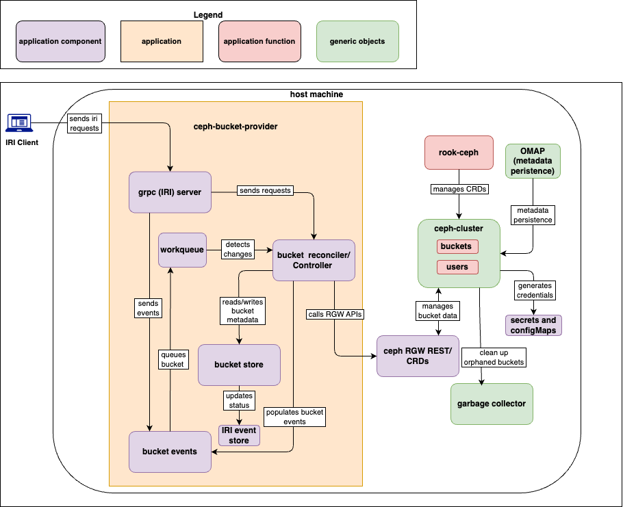

# Ceph-bucket-provider Components

This documentation describes the main components of ceph-bucket-provider and their inter-connections.

- [Component Diagram](#component-diagram)
- [IRI Client](#iri-client)
- [gRPC (IRI) Server](#grpc-iri-server)
- [Bucket Reconciler (Controller)](#bucket-reconciler-controller)
- [IRI Event Store](#iri-event-store)
- [Workqueue](#work-queue)
- [Bucket Store](#bucket-store)
- [Bucket Events](#bucket-events)
- [Ceph RGW REST / CRDs](#ceph-rgw-rest--crds)
- [Rook-Ceph](#rook-ceph)
- [Ceph Cluster](#ceph-cluster)
- [OMAP](#omap-metadata-persistence)
- [Secrets and ConfigMaps](#secrets-and-configmaps)
- [Garbage Collector](#garbage-collector)

## Component Diagram

|  |
| :---: |
| *Component diagram of main ceph-bucket-provider components* |

## IRI Client

The external initiator of storage operations. Represents the user or orchestration system that triggers workflows like bucket creation, deletion or list.

- Communicates via gRPC to the host machine.
- Acts as the entry point for external applications.
- Sends IRI requests --> gRPC (IRI) Server [Initiates bucket operations].

## gRPC (IRI) Server

Acts as the gateway into the ceph-bucket-provider and request validator for provider.

- Receives incoming IRI requests, validates parameters, and translates them into internal events.
- Implements the IRI gRPC interface. It is governed by an errgroup lifecycle to ensure that any crash in the server triggers a graceful application shutdown.
- Send requests  --> Bucket Reconciler [Forwards client request payloads to reconciler].

## Bucket Reconciler (Controller)

Controller that ensures the actual state of bucket matches the desired state. Reads metadata, applies reconciliation logic, and delegates. Reconciles the desired state of bucket in the Bucket Store with the actual state in the Ceph Cluster.

- Core logic component in Kubernetes operator pattern.
- Reads/writes bucket metadata.
- Orchestrates bucket lifecycle operations (create, update, delete).

- Updates metadata --> Bucket Store [Synchronizes bucket state].
- Calls RGW APIs / updates CRDs --> Ceph RGW (RADOS Gateway) REST / CRDs [Executes bucket operations].

## IRI Event Store

Persistent log of lifecycle events and status updates. Provides observability, auditability, and integration points for external systems.
It adds incoming events (Create/Delete/Update) to the workqueue.

- Bucket Store --> Status updates/events [Stores updates and events for debugging and external integrations].

## Work Queue

The work queue is a part of reconciler that schedules and manages tasks for reconciliations.

- Detects changes in bucket CRDs or incoming requests.
- Queues bucket-related tasks for reconciliation.
- Guarantees ordered and reliable processing of bucket operations.
- Triggers reconciliation --> Bucket Reconciler [Dispatches bucket tasks for processing].

## Bucket Store

Central metadata repository for bucket definitions and states. Maintains lifecycle information, synchronizes with reconcilers, and generates events.

- Maintains state of buckets within the system.
- Populates bucket events for downstream consumers.
- Acts as an internal registry of bucket objects.
- Generates events --> Bucket Events [Pushes bucket state changes downstream].

## Bucket Events

Event stream derived from Bucket Store changes. Provides a "push" mechanism for downstream observability tools or audit logs to react to  bucket creation, deletion, or failures.

- Emits events when bucket state changes (created, deleted, updated).
- Used for monitoring, logging, or triggering automation.
- Emits bucket events --> Observability tools.

## Ceph RGW REST / CRDs

- Ceph RGW REST API: Provides the interface to create/delete buckets and manages users.
- CRDs (Custom Resource Definitions): Kubernetes-native way to represent custom objects like bucket.
- Rook-Ceph operator manages these CRDs and translates them into Ceph RGW operations.

- Manages buckets & users --> Ceph Cluster [Executes storage operations].
- Provides credentials & configs [Ensures secure communication].
- Cleans up orphaned buckets --> Garbage Collector [Maintains cluster hygiene].

## Rook-Ceph

A Cloud Native storage orchestrator for Kubernetes. It automates the deployment, configuration, and management of Ceph. In this architecture, it specifically manages the CephBlockPool and CephClient resources required by the reconcilers.

- Watches Kubernetes CRDs (ObjectBucket, CephObjectStore, etc.) and reconciles them with Ceph RGW.
- Automates deployment, scaling, and lifecycle management of Ceph components inside the cluster.
- Provides Kubernetes‑native integration for object storage buckets.
- Ensures that Ceph RGW REST API operations are triggered when CRDs change.

- Rook‑Ceph Operator --> Ceph Cluster [Manages CRDs and applies changes to Ceph RGW/Cluster].

## Ceph Cluster

Backend distributed storage system. Manages buckets, integrates with Garbage Collector, Rook-Ceph, and OMAP.

- Actual storage backend.
- Contains:
    - Buckets: Object storage containers.
    - Users: Authentication and access control entities.
- Provides durability, replication, and scalability.
- Metadata persistence --> OMAP [Ensures consistency and recovery].

## OMAP (Metadata Persistence)

Metadata persistence layer in Ceph. A dedicated key-value store within Ceph used to maintain consistency.

- Metadata persistence --> Ceph Cluster [Provides reliable metadata storage for consistency and recovery].

## Secrets and ConfigMaps

- Store credentials, configuration, and connection details.
- Provide reconciler and RGW with necessary authentication and runtime parameters.
- Do not directly interact with buckets but are essential for secure operations.
- Provides credentials & configs --> Ceph RGW REST / CRDs [Enables secure API access].

## Garbage Collector

- Cleans up orphaned buckets (those left behind after CRD deletion or failed reconciliation).
- Ensures no stale resources remain in Ceph cluster.
- Maintains system hygiene and prevents resource leaks.
- Cleans up orphaned buckets <-- Ceph RGW REST / CRDs [Triggered after bucket deletion].
