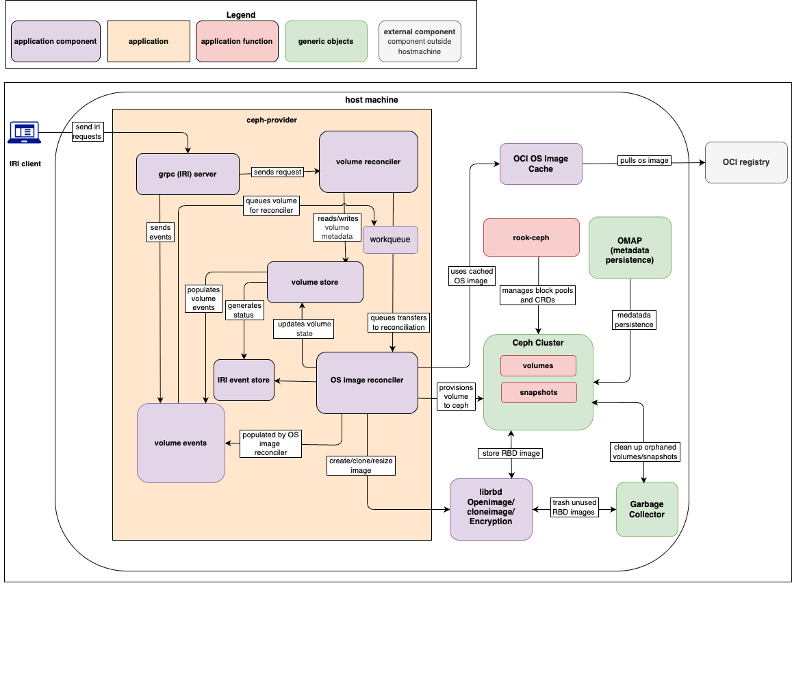

# Ceph-volume-provider Components

This documentation describes the main components of ceph-provider and their inter-connections.

- [Component Diagram](#component-diagram)
- [IRI Client](#iri-client)
- [gRPC (IRI) Server](#grpc-iri-server)
- [Volume Reconciler](#volume-reconciler)
- [OS Image Reconciler](#os-image-reconciler)
- [Volume Store](#volume-store)
- [IRI Event Store](#iri-event-store)
- [Workqueue](#work-queue)
- [Rook-ceph](#rook-ceph)
- [Volume Events](#volume-events)
- [OCI Image Cache](#oci-image-cache)
- [librbd](#librbd)
- [Ceph Cluster](#ceph-cluster)
- [OMAP](#omap-metadata-persistence)
- [Garbage Collector](#garbage-collector)
- [OCI Registry](#oci-registry)

## Component Diagram

|  |
| :---: |
| *Component diagram of main ceph-volume-provider components* |

## IRI Client

The external initiator of storage operations. Represents the user or orchestration system that triggers workflows like volume creation, deletion, or resizing.

- IRI-requests: Sends structured IRI requests into the system via gRPC.

## gRPC (IRI) Server

Acts as the gateway into the ceph-volume-provider and request validator for provider.

- Receives incoming IRI requests, validates parameters, and translates them into internal events.
- Implements the IRI gRPC interface. It is governed by an errgroup lifecycle to ensure that any crash in the server triggers a graceful application shutdown
- Send requests  --> Volume Reconciler [Forwards client request payloads to reconciliation logic].
- Send events  --> Volume Events [Emits events into the Volume Events stream for tracking and auditing].

## Volume Reconciler

Controller that ensures the desired state of volumes matches the actual state. Reads metadata, applies reconciliation logic, and delegates image-related tasks. Reconciles the desired state of volumes in the Volume Store with the actual state of images in the Ceph Cluster.

- Reads/writes volume metadata --> Volume Store [Synchronizes desired and actual state in metadata]
- Queues machine transfers to reconciliation  --> OS Image Reconciler [Delegates image-based provisioning tasks].

## OS Image Reconciler

Manages image-based provisioning of volumes. Uses cached OS images, performs operations via librbd, and updates the Volume Store.

- Updates volume state --> Volume Store [Updates metadata after provisioning to reflect actual state].
- Uses cached image <-- OCI Image Cache [Retrieves OS images locally to avoid repeated downloads].
- Create/clone/resize image  --> librbd [Instructs librbd to perform block device operations].
- Provisions volume to Ceph  --> Ceph Cluster [Ensures volumes are provisioned and registered inside Ceph].

## Volume Store

Central metadata repository for volume definitions and states. Maintains lifecycle information, synchronizes with reconcilers, and generates events.

- Reads/writes volume metadata <-- Volume Reconciler [Synchronizes desired and actual state].
- Updates volume state <-- OS Image Reconciler [Reflects changes after image provisioning].
- Populates volume events  --> Volume Events [Generates events whenever state changes].
- Status updates/events  --> IRI Event Store [Pushes lifecycle updates for persistence and external consumption].

## IRI Event Store

Persistent log of lifecycle events and status updates. Provides observability, auditability, and integration points for external systems.
It queues incoming events (Create/Delete/Update) and ensures they are delivered to the reconcilers even if processing is temporarily delayed.

- Status updates/events <-- Volume Store [Stores updates and events for debugging and external integrations].

## Work Queue

The work queue is a part of reconciler that schedules and manages tasks for reconciliations.

- This allows the system to handle multiple events and retries without losing track of any required actions.
- It acts as a buffer and coordinator to ensure that resource updates are processed efficiently and reliably without overloading the system.

## Rook-Ceph

A Cloud Native storage orchestrator for Kubernetes. It automates the deployment, configuration, and management of Ceph. In this architecture, it specifically manages the CephBlockPool and CephClient resources required by the reconcilers.

- Health Monitoring: Ensures that the underlying OSDs (Object Storage Daemons) are healthy before the Volume Reconciler attempts to map a device.

- Manages block pool and CRDs  --> Ceph Cluster [Configures and manages Ceph cluster resources].

## Volume Events

Event stream derived from Volume Store changes. Provides a "push" mechanism for downstream observability tools or audit logs to react to volume creation, deletion, or failures.

- Populates volume events <-- Volume Store [Provides triggers for downstream actions and observability].
- Queues volume for reconciler --> Workerqueue [Optimizes resource utilization].

## OCI Image Cache

A lookup table residing within the metadata layer that maps OCI Image Digests (SHA256) to existing Ceph RBD Snapshots. The local storage layer for OS images. It sits between the external registry and the Ceph cluster to minimize bandwidth and latency.

Fast-Clone Trigger, When a new request arrives, the OS Image Reconciler checks this store first. If a match is found, it bypasses the network pull and performs an rbd clone.

Cache Policy, It Maintains timestamps for "Last Used" to allow the Garbage Collector to prune old snapshots when the Ceph pool reaches capacity.

- Pull OS image <-- OCI Registry [Fetches OS images from external registry when not cached].
- Uses cached image --> OS Image Reconciler [Allows the reconciler to trigger a librbd clone from a pre-existing snapshot rather than a full download].

## librbd

Ceph RADOS Block Device library. The core API layer for Ceph RADOS Block Devices. It performs the heavy lifting for image manipulation and metadata assignment.

- Create/clone/resize image <-- OS Image Reconciler [Executes block device operations].
- Stores RBD image  --> Ceph Cluster [Persists RBD images into Ceph storage].

### Details

- create image <-- OS Image Reconciler [Creates new empty RBD images].
- clone image from snapshot <-- OS Image Reconciler [Creates new images from snapshots].
- resize image <-- OS Image Reconciler [Adjusts image size to match spec].
- set WWN <-- OS Image Reconciler [Writes WWN metadata].
- set encryption header <-- OS Image Reconciler [Applies encryption format].
- set image limits <-- OS Image Reconciler [Writes metadata constraints].
- stores RBD image  --> Ceph Cluster [Persists images in Ceph storage].
- trash image <-- Garbage Collector [Marks unused images for deletion].

## Ceph Cluster

Backend distributed storage system. Manages volumes and snapshots, integrates with librbd, Garbage Collector, Rook-Ceph, and OMAP. It manages the physical placement of data, replication, and the internal state of snapshots.

- Provisions volume to Ceph <-- OS Image Reconciler [Accepts provisioned volumes].
- Stores RBD image <-- librbd [Holds block device images].
- Cleanup orphaned volumes/snapshots <--> Garbage Collector [Removes stale or orphaned data].
- Metadata persistence <--> OMAP [Maintains metadata consistency and recoverability].

## OMAP (Metadata Persistence)

Metadata persistence layer in Ceph. A dedicated key-value store within Ceph used to maintain consistency.

- Metadata persistence <--> Ceph Cluster [Provides reliable metadata storage for consistency and recovery].

## Garbage Collector

Cleanup service ensuring cluster hygiene. Identifies and removes orphaned volumes/snapshots and deletes unused RBD images.

- Cleanup orphaned volumes/snapshots <--> Ceph Cluster [Deletes unused or stale volumes/snapshots].
- Trash unused RBD images <--> librbd [Removes unused RBD images to reclaim space].

## OCI Registry

External repository of OS images (e.g., Docker Hub, Quay). Serves as the authoritative source for images used in provisioning.

- Pull OS image  --> OCI Image Cache [Supplies OS images to be cached locally and used for provisioning].
